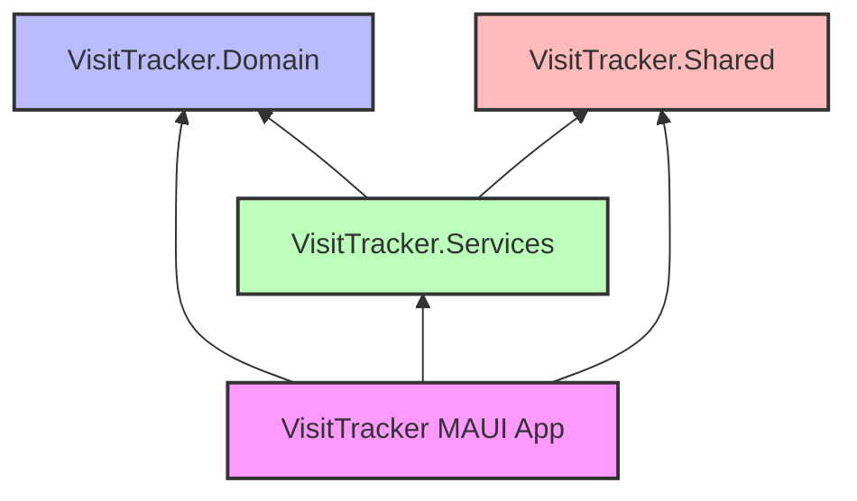

# VisitTracker Mobile

A .NET MAUI mobile application designed to manage and monitor home care services through three distinct roles:
1. **Care Workers**
2. **Supervisors**
3. **Service Users**

This application tracks Care Workers visits to the Service Users home and calculates comprehensive visit details using multi-modal sensing, managed by Supervisors.

## Overview

VisitTracker is structured as a cross-platform mobile application targeting iOS and Android platforms using [.NET MAUI](https://dotnet.microsoft.com/en-us/apps/maui). This mobile app provides functionality for tracking care worker visits and managing service user interactions.

## Architecture

The solution follows a clean architecture pattern and is organized into the following projects:

- **VisitTracker** - Main MAUI application project containing UI, controls and platform-specific code
- **VisitTracker.Domain** - Core domain models and business logic
- **VisitTracker.Services** - Application services and external integrations
- **VisitTracker.Shared** - Shared utilities and common functionality

## Tech Stack

- **.NET MAUI** (v8.0.100) - Cross-platform UI framework
- **C# 12** - Programming language
- **XAML** - UI markup language

### Key Libraries

- **CommunityToolkit.Mvvm** (v8.3.2) - MVVM architecture implementation
- **ReactiveUI.Maui** (v20.1.63) - Reactive programming extensions
- **Realm** (v20.0.0) - Mobile database
- **UraniumUI** - Material design controls and theming 
- **SkiaSharp.Extended.UI** - High-performance 2D graphics and custom controls
- **Firebase** - Push notifications and cloud messaging

## Features

**Supervisors**
- Care Worker Management
- Service User Management 
- Ground Truth & Fingerprint Management
- Visit Reports Management

**Care Workers**
- Visit Reports Submission
- Visit Tracking with Multi-Modal Sensing

**Service Users**
- Visit Reports Viewing

## Platform Support

- iOS 16.0+
- Android API 33+ (Android 13)

### Requirements

- .NET 8 SDK (v8.0.406)
  - [Download for Windows](https://dotnet.microsoft.com/en-us/download/dotnet/thank-you/sdk-8.0.406-windows-x64-installer)
  - [Download for macOS](https://dotnet.microsoft.com/en-us/download/dotnet/thank-you/sdk-8.0.406-macos-x64-installer)
- Visual Studio 2022 or Visual Studio Code
- .NET MAUI workload
- Android SDK (for Android development)
- Xcode 15+ (for iOS development)

After installing the .NET SDK, run:
```bash
dotnet workload restore
```

### Architecture Overview



### MVVM Architecture

The application follows the Model-View-ViewModel (MVVM) pattern:

- **Model**: Domain entities and business logic in `VisitTracker.Domain`
  - Represents the data and business rules
  - Independent of UI logic

- **View**: XAML pages in `VisitTracker/Controls` and controls in `VisitTracker/Views`
  - Represents the UI elements
  - Binds to ViewModels through data binding
  - Platform-specific customizations in `/Platforms`

- **ViewModel**: UI logic and state management
  - Located in `VisitTracker/Views`
  - Implements `INotifyPropertyChanged` for UI updates
  - Uses `CommunityToolkit.Mvvm` for MVVM implementation
  - Handles user interactions and business logic coordination

### Project Structure

- `/src` - Source code
  - `/Libraries` - Core libraries and services
    - `/VisitTracker.Domain` - Core domain models
    - `/VisitTracker.Services` - Application services
    - `/VisitTracker.Shared` - Common utilities
  - `/VisitTracker` - MAUI application
    - `/Core` - Core helpers and extensions
    - `/Controls` - Reusable UI controls
    - `/Views` - Application pages
    - `/Platforms` - Platform-specific code

## Configuration

Firebase configuration files are required for push notifications:
- Android: `google-services.json`
- iOS: `GoogleService-Info.plist`