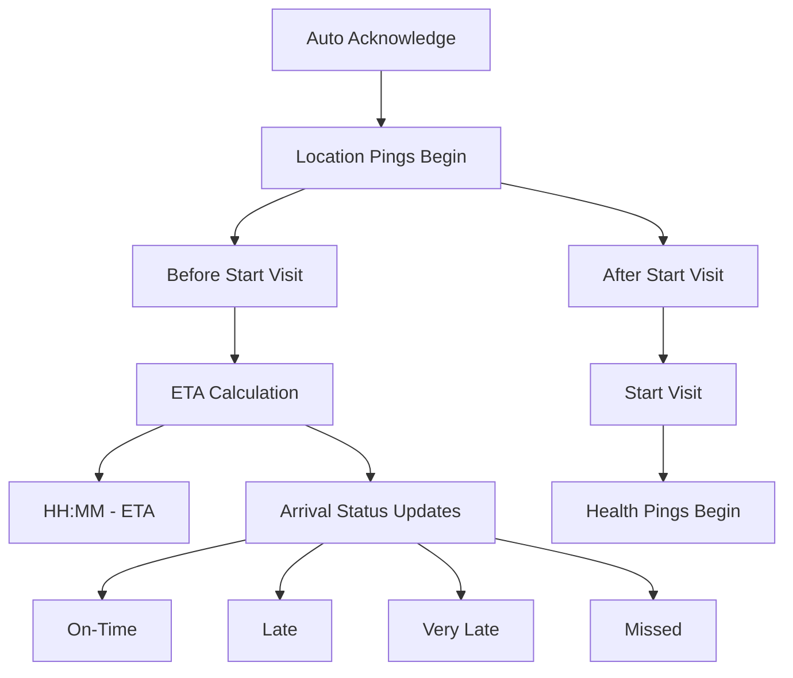

# ETA Tracking System

## Overview

The ETA (Estimated Time of Arrival) Tracking System monitors careworker movements and provides real-time arrival estimations for service users and coordinators. This document outlines the key components and processes involved in ETA calculation and health ping monitoring.

## ETA Calculation

### Initialization

When a careworker has an upcoming booking, the system begins tracking their location to provide ETA information:

- **Initialization Conditions (Auto-Acknowledge)**: Activates automatically when the sensing logic starting conditions are met (as described in the [Sensing Logic Documentation](sensing-logic.md))
- **Location Pings**: Once activated, the app sends location data to the server every 5 minutes
- **Disconnection Monitoring**: If the careworker is disconnected (due to closed app or disabled internet), the system sends push notifications requesting reconnection

### Status Calculation

The server processes location data to determine the careworker's ETA and arrival status:

- **ETA & Arrival Status Calculation**: Based on current location, travel mode, traffic conditions, and distance to service user's home
- **Push Notifications**: ETA updates are sent to both careworker and service user mobile devices

### Arrival Status Types

The system classifies the careworker's arrival status into four categories:

| Status | Description |
|--------|-------------|
| **On-Time** | Careworker expected to arrive at or before scheduled time |
| **Late** | Careworker expected to arrive within acceptable delay window |
| **Very Late** | Careworker expected to arrive with significant delay |
| **Missed** | Careworker unlikely to make the appointment or severely delayed |

The status is continuously updated based on the latest location data until the careworker arrives and starts the visit.

## Health Pings

### Active Visit Monitoring

After a visit has started, location tracking continues with additional purpose:

- **Regular Updates**: Location data continues to be sent every 5 minutes
- **Activity Confirmation**: Helps verify that careworker is actively providing care

### Post-Visit Tracking

Even after the visit report is submitted, the system continues monitoring:

- **Continued Pings**: Location data transmission continues
- **Termination Conditions**: Tracking persists until sensing logic termination conditions are met (as described in the [Sensing Logic Documentation](sensing-logic.md))

### Health Ping Applications

Health pings serve multiple purposes within the care delivery system:

- Verify care is being provided at the correct location
- Track actual time spent at service user's home
- Detect premature departures or extended stays
- Provide data for quality assurance and service improvement
- Support billing verification and compliance requirements

### Code References

- **Tracker Service**  
  File: [CareWorkerTrackerService.cs](../../../src/VisitTracker/Core/Services/CareWorkerTrackerService.cs)

  | Operation | Method | Description |
  |-----------|--------|-------------|
  | Location Processing | `ProcessLocation` | Processes incoming location data and determines if threshold time has elapsed since last ping |

- **API Service**  
  File: [IVisitApi.cs](../../../src/Libraries/VisitTracker.Services/Services/Visit/IVisitApi.cs)

  | Operation | Method | Description |
  |-----------|--------|-------------|
  | Location Transmission | `PingLocation` | Transmits location data to server for both ETA calculation and health ping monitoring |

For more detailed information on the sensing logic that powers the ETA system, please refer to the [Sensing Logic Documentation](sensing-logic.md).