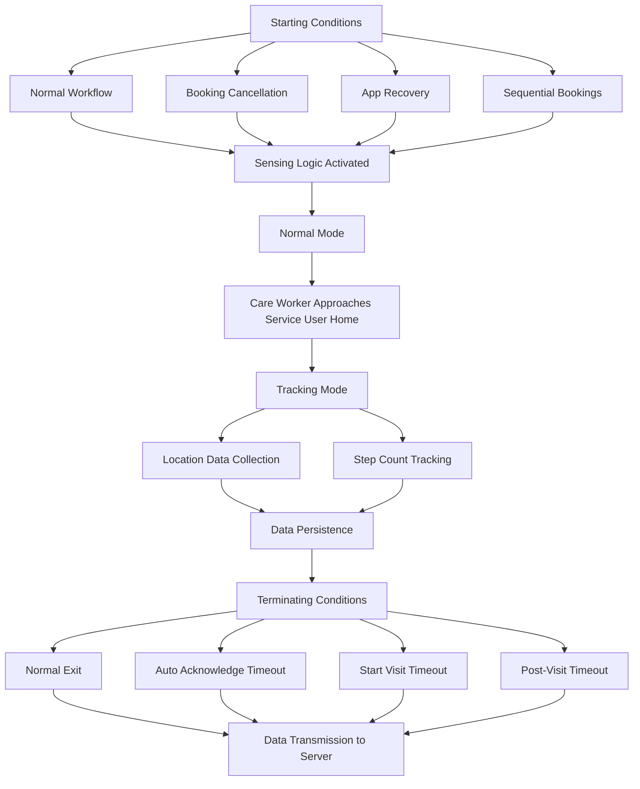

# Sensing Logic System

## Overview
The Sensing Logic System is a core module in the VisitTracker mobile application that fuses multimodal sensor data, monitors care worker movements, and provides critical location-based services. This document outlines the key components, operation modes, and lifecycle of the sensing logic.

## Starting Conditions
The sensing logic can be activated through two primary mechanisms:

### 1. Auto-Acknowledge Process
When a care worker has an upcoming booking, the system can automatically begin tracking under specific conditions. Auto-acknowledge can be triggered through four distinct pathways:

| Trigger Point | Description |
|---------------|-------------|
| Normal Workflow | Care worker opens the mobile app and has an upcoming booking within one hour |
| Booking Cancellation | Current booking is cancelled via push notification, and upcoming booking is within one hour |
| App Recovery | Sensing logic was running when app crashed; restarted upon reopening |
| Sequential Bookings | Previous booking's sensing logic terminates and upcoming booking meets start conditions |

#### Code References

- **Tracker Service**  
  File: [CareWorkerTrackerService.cs](../../../src/VisitTracker/Core/Services/CareWorkerTrackerService.cs)

  | Operation | Method | Description |
  |-----------|--------|-------------|
  | Start By Auto Ack | `StartNormalModeByAck` | Starts the normal mode as a result of Auto Acknowledge process of the sensing logic module |

### 2. Manual Start Visit
When care workers arrive at a service user's home more than one hour before the scheduled booking time:

- Auto-acknowledge will not trigger automatically
- Care worker can manually press the "Start Visit" button
- Sensing logic activates without pre-visit ETA calculation
- Care worker must be physically present at the service user's location
- System verifies location before allowing visit to start

#### Code References

- **Tracker Service**  
  File: [CareWorkerTrackerService.cs](../../../src/VisitTracker/Core/Services/CareWorkerTrackerService.cs)

  | Operation | Method | Description |
  |-----------|--------|-------------|
  | Start By Start Visit | `StartNormalModeBySV` | Starts the normal mode as a result of Start Visit invocation by Care Worker |

## Operation Modes
The sensing logic operates in two distinct modes with different data collection behaviors:

### Normal Mode
The initial operation mode focuses on basic location tracking:

- Lower frequency location updates
- No step count collection
- Continues until care worker enters the geofence around service user's home
- Boundary radius: `Constants.GeoBoundaryExternalInMetres`

#### Code References

- **Tracker Service**  
  File: [CareWorkerTrackerService.cs](../../../src/VisitTracker/Core/Services/CareWorkerTrackerService.cs)

  | Operation | Method | Description |
  |-----------|--------|-------------|
  | Start Normal Mode | `StartNormalMode` | Starts the normal mode of the sensing logic module |
  | Stop Normal Mode | `StopNormalMode` | Stops the normal mode including the tracking mode if activated |
  | Resume Normal Mode | `ResumeNormalMode` | Resumes the  normal mode of the sensing logic module after any crash |

### Tracking Mode
Higher precision mode activated when care worker approaches service user's home:

- Increased frequency of location updates (variable based on booking duration)
- Step count collection begins
- Rotation vector sensor data used for movement direction
- Continues until sensing logic termination

#### Code References

- **Tracker Service**  
  File: [CareWorkerTrackerService.cs](../../../src/VisitTracker/Core/Services/CareWorkerTrackerService.cs)

  | Operation | Method | Description |
  |-----------|--------|-------------|
  | Start Tracking Mode | `StartTrackingMode` | Starts the tracking mode of the sensing logic module |
  | Stop Tracking Mode | `StopTrackingMode` | Stops the  tracking mode of the sensing logic module |

#### Tracking Frequency Based on Booking Duration
| Booking Duration | Update Frequency Constant         |
|------------------|-----------------------------------|
| ≤ 60 minutes     | `Constants.TrackingModeInterval1hrInMs` |
| ≤ 240 minutes    | `Constants.TrackingModeInterval2hrInMs` |
| ≤ 720 minutes    | `Constants.TrackingModeInterval4hrInMs` |
| > 720 minutes    | `Constants.TrackingModeInterval12hrInMs`|

## Data Collection
### Location Data
Two classes of location data are collected:

- **Class A**: High-resolution GPS signals
- **Class B**: Network-based signals

### Step Count Data
Step detection uses multiple sensors for accurate movement tracking:

- Accelerometer data processed to detect step patterns
- Rotation vector sensor to determine direction
- Steps correlated with location data

#### Code References

- **Tracker Service**  
  File: [CareWorkerTrackerService.cs](../../../src/VisitTracker/Core/Services/CareWorkerTrackerService.cs)

  | Operation | Method | Description |
  |-----------|--------|-------------|
  | Processing & Persisting Location Data | `ProcessLocation` | Processing includes ETA logic, termination logic checks along with persistence of location |
  | Persisting Step Count Data | `ProcessStepCount` | Persistence of Step Count data |

## Terminating Conditions
The sensing logic will terminate under any of the following conditions:

| Condition              | Description                                           |
|------------------------|-------------------------------------------------------|
| Normal Exit            | Care worker submits visit report and exits service user's home within `Constants.TimeoutVisitUploadInMins` |
| Auto Acknowledge Timeout| Visit acknowledged but never started after `Constants.TimeoutVisitAckInMins`                  |
| Start Visit Timeout    | Visit started but report never submitted `Constants.TimeoutVisitStartInMins` + `Booking Duration` |
| Post-Visit Timeout     | Care worker remains at location after report submission until `Constants.TimeoutVisitUploadInMins` |

Upon termination, the location and step count data is packaged and transmitted to the server for post-processing.

## Integration with Other Systems
The sensing logic integrates with multiple components of the mobile application:

- **Visit Flow:** Provides location verification for visit start/end [Visit Flow Documentation](../visits/visit-flow.md)
- **ETA System:** Supplies location data for arrival time estimation [ETA Documentation](eta.md)

## Code Implementation

- [CareWorkerTrackerService:](../../../src/VisitTracker/Core/Services/CareWorkerTrackerService.cs) Sensing logic implementation for Care Workers
- [CareWorkerLocationService:](../../../src/VisitTracker/Core/Services/LocationService.cs) Platform-specific extended implementation for Android/iOS for Care Workers
- [SupervisorTrackerService:](../../../src/VisitTracker/Core/Services/SupervisorTrackerService.cs) Sensing logic implementation for Supervisors (Similar implementation)
- [SupervisorLocationService:](../../../src/VisitTracker/Core/Services/LocationService.cs) Platform-specific extended implementation for Android/iOS for Supervisors (Similar implementation)

  | Operation | Method | Description |
  |-----------|--------|-------------|
  | Initialize Sensing Logic | `Initialize` | Initialization sensing logic and before the start |
  | Uninitialize Sensing Logic | `Uninitialize` | Uninitialization of sensing logic after the termination |