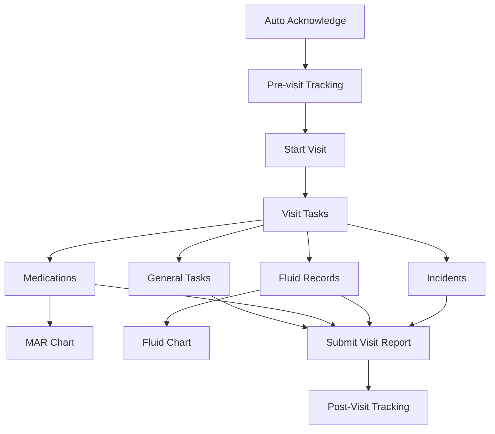

## Visit Flow in VisitTracker
### Overview
The VisitTracker mobile application manages the complete flow of home care visits through a structured process. This document outlines the key stages and components of a visit from initiation to completion.

### Visit Participants
- **Service User**: The end user receiving care services
- **Care Worker**: The professional carer visiting the Service User's home to provide care

### Visit Initialization
#### Pre-Visit Requirements
Before a Care Worker can start a visit, the following prerequisites must be met:

- Service User must have established ground truth location
- Fingerprints must be recorded for the Service User's location

#### Auto-Acknowledge Process
When a Care Worker opens the app within one hour of a booking's start time:

- The system's sensing logic automatically activates
- Visit appears as "Upcoming" in the Care Worker's interface
- Start Visit button appears, but can only be started when:
    - Care Worker is physically at the Service User's location
    - All pre-visit requirements are satisfied

#### Starting the Visit
The Care Worker must:

1. Arrive at the Service User's location
2. Tap "Start Visit" on the upcoming booking screen
3. Complete biometric verification if required
4. The system verifies the Care Worker's location and other prerequisites before allowing the visit to start

Once started successfully, all the visits functionalities will become available.

### Visit Components
#### General Tasks
Each visit includes general tasks that the Care Worker must complete:

- Tasks show a detailed description of required activities
- Care Worker can mark completion status (Completed, Unable to Complete, etc.)
- Notes can be added to provide additional context
- Attachments (images/audio recordings) can be uploaded
- Body maps can be created to document physical observations

##### Code References (General Tasks):
- **View:** [TaskDetailPage.xaml](../../../src/VisitTracker/Views/TaskDetail/TaskDetailPage.xaml)
- **ViewModel:** [TaskDetailVm.cs](../../../src/VisitTracker/Views/TaskDetail/TaskDetailVm.cs)
    | Operation | Method |
    |-----------|--------|
    | Initialization | `Init` |
    | Persistence | `SaveTask` |

#### Medication Tasks
Medication tasks require special handling and documentation:

- System displays medication details (type, dosage, intake preferences, schedule)
- Action guidance is provided based on timing:
    - "Proceed to administer" if within the scheduled time plus grace period
    - "Enquire office" if outside the scheduled window
- Completion status must be recorded
- Status details vary based on completion such as:
    - If successful: who administered the medication
    - If unable to complete: reason for failure
- Low supply indicator available to alert office
- Supporting attachments and body maps can be added

##### Code References (Medication Tasks):
- **View:** [MedicationDetailPage.xaml](../../../src/VisitTracker/Views/MedicationDetail/MedicationDetailPage.xaml)
- **ViewModel:** [MedicationDetailVm.cs](../../../src/VisitTracker/Views/MedicationDetail/MedicationDetailVm.cs)
    | Operation | Method |
    |-----------|--------|
    | Initialization | `Init` |
    | Persistence | `SaveMedication` |
    | Request Administration Approval | `OnReqMedicationAdministration` |

##### MAR Chart (Medication Administration Record)
The MAR Chart provides a comprehensive view of medication administration:

- Monthly calendar view of all medications
- Records of administration status for each scheduled medication
- Notes entered by all Care Workers during administration
- Helps track medication compliance over time

##### Code References (MAR Chart):
- **View:** [MarChartPage.xaml](../../../src/VisitTracker/Views/MarChart/MarChartPage.xaml)
- **ViewModel:** [MarChartVm.cs](../../../src/VisitTracker/Views/MarChart/MarChartVm.cs)
    | Operation | Method |
    |-----------|--------|
    | Initialization | `Init` |
    | Select Medication | `DateSelected` |
    | Dismiss Notes | `HideWindow` |
    | Navigate Calendar | `OnSlide` |
    | Return to Today | `GoToday` |

#### Fluids
Fluids may be optional or mandatory depending on the booking:

- Intake tracking (measured in ml):
    - Oral intake
    - IV/SC intake
    - Other intake sources
- Output tracking (measured in ml):
    - Urine output
    - Vomit output
    - Tube output
    - Other output
- At least one intake and one output must be recorded
- Notes can be added for context
- Supporting attachments and body maps can be added

##### Code References (Fluids):
- **View:** [FluidDetailPage.xaml](../../../src/VisitTracker/Views/FluidDetail/FluidDetailPage.xaml)
- **ViewModel:** [FluidDetailVm.cs](../../../src/VisitTracker/Views/FluidDetail/FluidDetailVm.cs)
    | Operation | Method |
    |-----------|--------|
    | Initialization | `Init` |
    | Persistence | `SaveFluid` |

#### Fluid Chart (24-Hour)
The Fluid Chart provides hydration monitoring:

- Shows all fluid records from the past 24 hours
- Displays intake and output totals
- Calculates fluid balance
- Helps Care Workers assess the Service User's hydration status

##### Code References (Fluid Chart):
- **View:** [FluidChartPage.xaml](../../../src/VisitTracker/Views/FluidChart/FluidChartPage.xaml)
- **ViewModel:** [FluidChartVm.cs](../../../src/VisitTracker/Views/FluidChart/FluidChartVm.cs)
    | Operation | Method |
    |-----------|--------|
    | Initialization | `Init` |

#### Incident Reporting
When unexpected events occur, Care Workers can document them:

- Incident type classification
- Injury type (if applicable)
- Treatment details
- Detailed notes
- Supporting attachments
- Body maps to document affected areas

##### Code References (Incident Report):
- **View:** [IncidentReportPage.xaml](../../../src/VisitTracker/Views/IncidentReport/IncidentReportPage.xaml)
- **ViewModel:** [IncidentReportVm.cs](../../../src/VisitTracker/Views/IncidentReport/IncidentReportVm.cs)
    | Operation | Method |
    |-----------|--------|
    | Initialization | `Init` |
    | Persistence | `SaveIncidentReport` |

### Visit Summary
Before completing a visit, Care Workers must provide:

- Short remarks (from predefined multi-selection options)
- Health status indicators (from predefined multi-selection options)
- Consumables used with quantities
- General visit summary notes
- Any additional attachments or body maps relevant to the overall visit (not specific to tasks)

## Visit Completion
### Submitting the Visit Report
Once all required components are completed:

1. Care Worker reviews the complete visit data
2. Submits the visit report through the application
3. Data is synchronized with the server
4. Visit status changes to "Completed"

### Post-Visit Tracking
After report submission:

- The sensing logic continues to run
- Tracking continues until termination conditions are met (e.g.,  Care Worker leaving the Service User's location)
- System records the actual end time of the visit

##### Code References (Visit):
- **View:** [OngoingPage.xaml](../../../src/VisitTracker/Views/Ongoing/OngoingPage.xaml)
- **ViewModel:** [OngoingVm.cs](../../../src/VisitTracker/Views/Ongoing/OngoingVm.cs)
    | Operation | Method |
    |-----------|--------|
    | Initialization | `Init` |
    | Downloading HandOver Notes | `DownloadHandOverNotes` |
    | Starting a Visit | `StartVisit` |
    | Opening Task | `OpenTask` |
    | Opening Medication | `OpenMedication` |
    | Opening Fluid | `OpenFluidDetail` |
    | Uploading Visit Report | `OnSubmit` |

For more detailed information on the sensing and tracking logic, please refer to the [Sensing Logic Documentation](../tracking/sensing-logic.md).